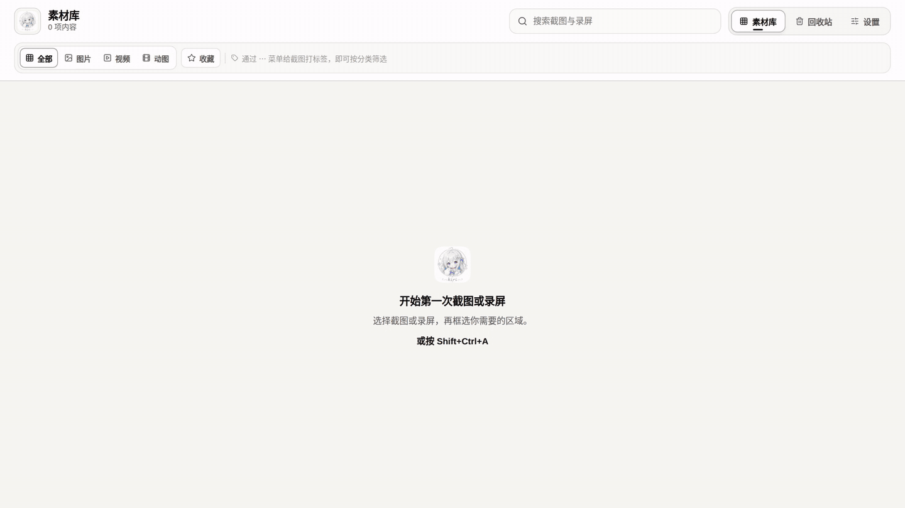

<div align="center">
  
  <h1>Kiri</h1>
  <p>本地优先的截图、标注、OCR 与区域录屏工具。</p>
  <p>
    <strong>简体中文</strong>
    · <a href="README_EN.md">English</a>
    · <a href="README_JA.md">日本語</a>
  </p>
</div>

Kiri 支持 macOS 和 Windows。按 `⇧⌘A`（macOS）或 `Shift+Ctrl+A`（Windows），选择窗口或区域，即可截图、标注、识别文字或录屏。截图会复制到剪贴板；截图、MP4 和 GIF 保存在本地素材库。

<!-- project-demo-v1 -->
## 演示

[](docs/demos/demo.mp4)

[完整视频（MP4）](docs/demos/demo.mp4) · [演示说明](docs/demos/README.md)

框选、箭头、文字标注，以及撤销与重做。 真实前端录制，使用示例数据。不包含系统截图、OCR 或导出验收。
<!-- /project-demo-v1 -->

## 功能

- **截图与标注**：点击窗口或拖选区域，使用裁剪、画笔、图形、箭头、文字、马赛克、撤销和重做。新版创建的标注可从完成卡或素材库继续编辑。
- **OCR**：默认使用 macOS Vision 或 Windows.Media.Ocr 在本机识别；可选远程 OCR 每次发送前都会确认。
- **录屏与 GIF**：录制指定区域，可选系统声音、麦克风、指针和点击高亮，输出 MP4 或 GIF。
- **本地素材库**：支持搜索、收藏、标签、重命名和可恢复的回收站。可在设置中使用其他本机目录或外接盘。

## 下载与安装

公开版本见 [GitHub Releases](https://github.com/yuxino/kiri/releases)；macOS 稳定包与 Windows 候选包的发布状态可能不同。

从 v1.4.9 起，设置页支持手动检查、下载并安装经过签名验证的更新；每一步都需要你明确点击，Kiri 不会后台检查或静默安装。v1.4.8 及更早版本需要先从 Releases 手动安装一次 v1.4.9，之后才能使用应用内更新。

- **macOS 14+**：下载 Universal `.dmg`（Apple 芯片与 Intel），把 `Kiri.app` 拖入“应用程序”。截图与录屏需要“屏幕与系统音频录制”权限；点击高亮才需要“输入监控”。麦克风录制需要 macOS 15+。
- **Windows 11（x64）**：当前源码已支持。v1.4.8 安装包仍是草稿候选，正在完成截图流程的真机验收，尚未正式发布。运行 `.exe` 安装程序；屏幕捕获不需要额外系统授权，麦克风权限由 Windows 隐私设置控制。安装程序未经过 Authenticode 签名，SmartScreen 可能提示警告。

macOS 发布包使用项目维护的本地自签名身份，未使用 Developer ID 签名或 Apple 公证。首次启动若被拦截，请按住 Control 点按 `Kiri.app` 并选择“打开”，或在“系统设置 → 隐私与安全性”中选择“仍要打开”。

## 隐私

素材、OCR 和编码默认都在本机处理。远程 OCR 完全可选，API Key 保存在 macOS 钥匙串或 Windows 凭据管理器中，每次请求都需要明确点击“发送”或“重试”。

可重编辑截图会在本地保存未加标注的源图；其中可能仍有被马赛克或图形遮住的像素。保存裁剪会同时移除框外像素。macOS 的 MP4 录屏、合并、缩略图和 GIF 生成使用 AVFoundation 与 ImageIO；Windows 使用 Media Foundation 与系统图像组件。两个平台都不下载 FFmpeg，媒体处理始终在本机完成。

## 从源码运行

需要 Rust 1.88+、Node.js 20.19+（或 22.12+）和 pnpm。macOS 需要 Xcode Command Line Tools；Windows 需要 MSVC C++ 构建工具。

```bash
git clone https://github.com/yuxino/kiri.git
cd kiri
pnpm install
pnpm tauri dev
pnpm tauri build --no-bundle
```

macOS 开发版还需要稳定的签名身份。请通过 Tauri 命令运行或构建；普通 `cargo build` 生成的二进制不包含前端资源。

## 快捷键

- **⇧⌘A**（macOS）/ **Shift+Ctrl+A**（Windows）：打开 Kiri
- **Esc**：取消截图；录屏时停止录制
- **Return**：确认截图
- **C**：在截图编辑器中裁剪
- **⌘F**（macOS）/ **Ctrl+F**（Windows）：搜索素材库
- **⌘Z / ⇧⌘Z**（macOS）/ **Ctrl+Z / Shift+Ctrl+Z**（Windows）：撤销 / 重做

另见 [隐私说明](PRIVACY_ZH.md)、[路线图](ROADMAP.md)、[贡献指南](CONTRIBUTING.md)、[安全策略](SECURITY.md) 与[文档索引](docs/README.md)。

[MIT](LICENSE) © 2026 yuxino
