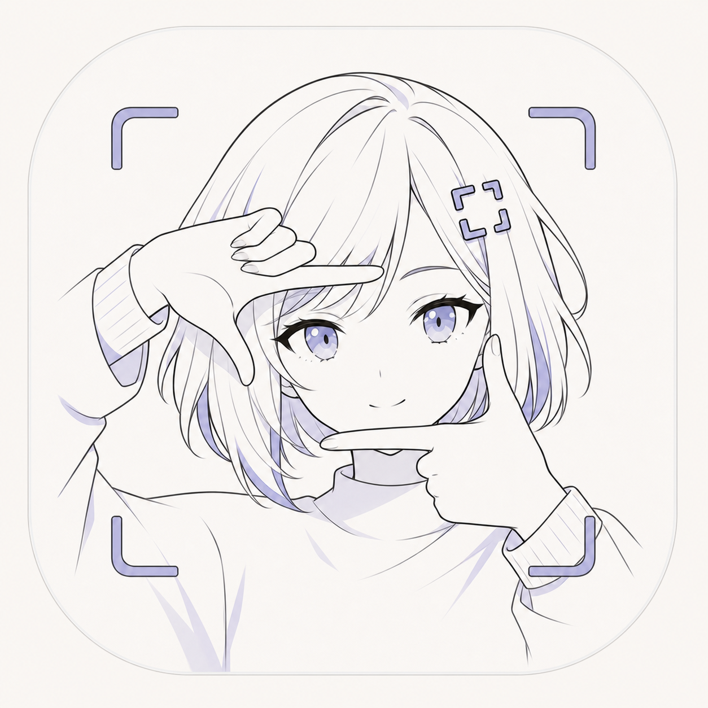

<div align="center">
  
  <h1>kiri</h1>
  <p>轻快、可找回的 macOS 截图工具</p>
  <p>
    <strong>早期预览版</strong>
    · <a href="README_EN.md">English</a>
    · <a href="README_JA.md">日本語</a>
  </p>
</div>

`kiri` 来自日语「切り取り」，意思是截取、裁切。

它是一款原生 macOS 视觉捕获工具：快速截取屏幕区域并复制，也可按需添加标注，
同时自动把结果放进本地素材库。即使剪贴板内容被覆盖，刚刚的截图仍然可以找回。

## 现在可以做什么

- 使用被 Kiri 完整拦截的 **⇧⌘A** 启动截图，避免同时触发其他应用操作
- 提供简体中文与英文界面，并自动跟随 macOS 的首选语言
- 冻结当前屏幕后手动拖出精确选区，并可自由移动或八向拉伸调整大小
- 松开选区后立即显示完整工具栏，仍可移动或八向拉伸；选择绘图工具后再锁定区域
- 使用画笔、矩形、直线、箭头、文字和连续涂抹式马赛克，并支持撤销与重做
- 默认鼠标工具可选中并拖动已有文字，双击即可重新编辑内容与样式
- 鼠标工具也可移动画笔和马赛克、八向拉伸矩形、调整直线与箭头端点，并支持 Delete 删除
- 画笔、形状线宽、文字字号和马赛克笔刷均可用连续滑杆调节；文字输入中或重新编辑后也能实时改字号
- 马赛克保留轻度、标准、强力三档像素强度
- 提供 8 种标注颜色；文字支持中文输入、长文本自动扩展，以及透明、深色、浅色背景
- 文字背景默认透明，每条文字会独立保留自己的颜色和背景样式
- 在任意截图阶段按 Esc 取消，选区出现后按 Return 直接复制
- 默认截图完成后只写入剪贴板并回到原 App，不会自动弹出 Kiri 素材库
- 也可保存、贴图或进入完整编辑器继续处理
- 选区浮层第一层直接切换截图或录屏，不再把录屏藏在截图标注工具栏
- 开始录屏前可切换 3 秒倒计时、系统声音、麦克风、鼠标指针和点击高亮
- 录制前用不遮挡画面的居中 3·2·1 提示倒计时，期间可按 Esc 取消
- 按屏幕 Retina 比例录制高质量 MP4，避免选区录屏被低分辨率缩放后发糊
- 录制时悬浮显示计时、暂停/继续和停止；Kiri 控制界面与暂停时间都不会进入最终视频
- 点击高亮使用录制中也实时可见的紫色扩散圆环，并同步写入成片
- 录屏在后台保存并恢复原 App 焦点，需要时再从菜单栏主动打开素材库
- 15 秒以内的素材库视频可直接转换为循环 GIF，无需安装 FFmpeg
- 每次完成只保存一份结果图，并自动进入本地历史记录
- 在本地素材库中搜索、收藏和再次复制
- 在列表卡片上直接将截图移入废纸篓，再恢复或永久删除
- 记录来源应用、尺寸、类型和创建时间
- 运行时同时保留 Dock 图标与菜单栏快捷入口

> kiri 目前处于早期源码预览阶段。带音频与鼠标反馈的区域录屏、短视频 GIF
> 已进入 v0.2 预览；裁剪和滚动长截图仍在开发中。

## 下载与安装

从 [GitHub Releases](https://github.com/yuxino/kiri/releases/latest) 下载
`Kiri-v0.1.0-macos.zip`，解压后把 `Kiri.app` 拖入“应用程序”文件夹。

v0.1.0 是尚未经过 Apple 公证的早期预览版。macOS 第一次打开时可能需要在 Finder 中
按住 Control 点击 Kiri，选择“打开”并确认。请始终从本仓库的 Releases 页面下载。

第一次使用 **⇧⌘A** 时，请按提示允许“输入监控”；第一次截图时请允许
“屏幕与系统音频录制”。权限只用于全局截图快捷键和本地截图，不会上传屏幕内容。

## 从源码运行

需要 macOS 14+ 和 Swift 6。

```bash
git clone https://github.com/yuxino/kiri.git
cd kiri
swift run kiri-core-tests
./scripts/install-app.sh
open /Applications/Kiri.app
```

安装脚本会生成统一的 `Kiri.app` 并安装到固定的 `/Applications/Kiri.app`。
更新时会先关闭正在运行的 Kiri 副本。请只运行这份正式安装版；Kiri 也会自动关闭
误启动的同 bundle ID 旧副本，避免 macOS
把快捷键和隐私权限关联到临时构建路径。

底层打包脚本会优先选择 Apple Development、Developer ID 或 Kiri 已有的稳定本地证书，
并拒绝静默使用会破坏录屏授权的临时签名。也可用
`KIRI_CODESIGN_IDENTITY="证书名称" ./scripts/package-app.sh` 明确指定证书；只有不需要
持久录屏权限的临时构建才应设置 `KIRI_ALLOW_ADHOC_SIGNING=1`。

第一次启动快捷键时，macOS 会要求“输入监控”权限；第一次截图时会要求
“屏幕与系统音频录制”权限。授权后如果截图仍不可用，请退出并重新打开 Kiri。
Kiri 每次运行最多调用一次系统授权请求；如果权限尚未生效，
提示条只会提供“打开设置”或“退出 kiri”，不会在每次截图时重复弹出系统窗口。

## 截图快捷操作

- **⇧⌘A**：在系统范围内启动 Kiri 截图，并独占这组快捷键
- **Esc**：在选区、标注或文字输入阶段取消整次截图
- **Return**：提交当前文字并复制截图
- **V**：切回鼠标工具，选择、移动或调整已有标注；双击文字可重新编辑
- **P / R / L / A / T / M**：画笔、矩形、直线、箭头、文字、马赛克
- **Delete**：删除鼠标工具当前选中的标注
- **⌘Z / ⇧⌘Z**：撤销 / 重做

## 素材保存在哪里

kiri 默认把素材保存在：

```text
~/Library/Application Support/kiri/
```

所有内容默认只留在本机，不会自动上传。删除的素材会先进入 kiri 自己的废纸篓。

## 区域录屏与 GIF（v0.2 预览）

1. 按 **⇧⌘A** 并框选录制区域。
2. 在底部第一层模式选择器中切换到 **录屏**，再框选录制区域。
3. 自动出现录屏设置，按需切换倒计时、系统声音、麦克风、鼠标指针和点击高亮。
4. 点击 **开始录制**；3·2·1 期间可按 Esc 取消。
5. 使用悬浮控制条暂停、继续或停止；菜单栏 Kiri 与“截图 / 录屏”菜单提供相同操作。
6. 停止后 MP4 自动进入素材库；15 秒以内的视频还能选择 **转换为 GIF**。

音频默认关闭并记忆上次选择；只有打开麦克风时才会请求麦克风权限。点击高亮由 Kiri 实时绘制；麦克风录制需要 macOS 15 或更高版本。

## 接下来

- **v0.1**：实体多显示器验收、正式签名与 Apple 公证
- **v0.2**：完善录屏状态浮层和裁剪
- **v0.3**：滚动长截图、自动拼接和接缝修正

完整计划见 [ROADMAP.md](ROADMAP.md)。

## 参与 kiri

Issue 和 Pull Request 都欢迎。开始之前请阅读
[CONTRIBUTING.md](CONTRIBUTING.md)；安全问题请按
[SECURITY.md](SECURITY.md) 私下报告。

[MIT](LICENSE) © 2026 yuxino
