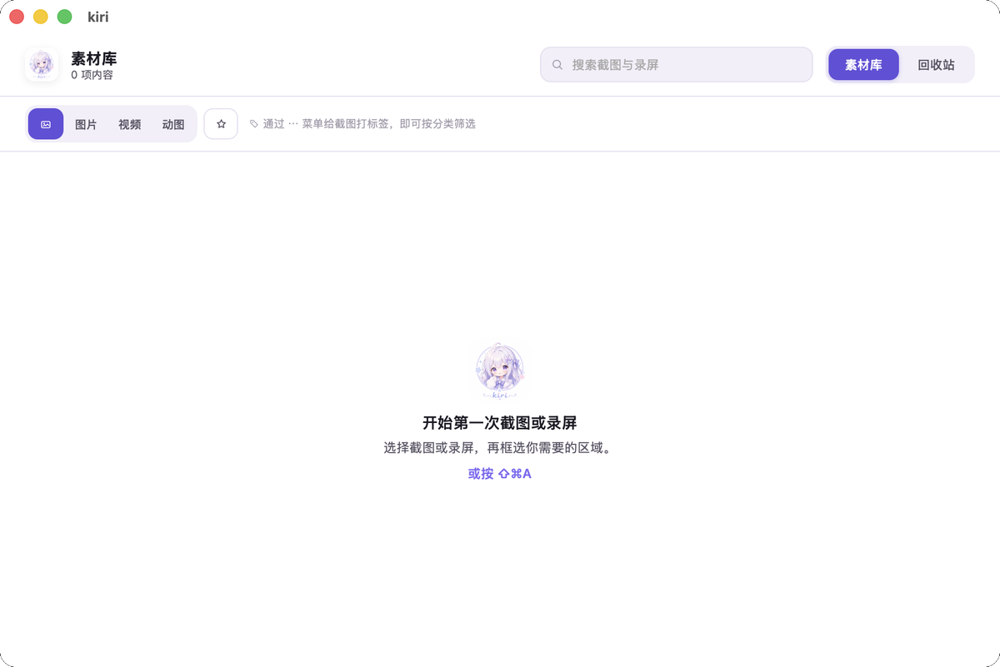

<div align="center">
  
  <h1>kiri</h1>
  <p>A fast, local-first capture workspace for macOS and Windows.</p>
  <p>
    <a href="README_ZH.md">简体中文</a>
    · <a href="README_JA.md">日本語</a>
  </p>
</div>

`kiri` comes from the Japanese word 「切り取り」—to clip or cut out.

Capture screenshots, annotate, recognize text, record regions, and keep everything in a local library. No cloud account required; optional remote OCR is always user-controlled.

## Screenshots



## Features

- **Screenshots** — window or region capture with precise selection.
- **Annotations** — pen, shapes, arrows, text, and mosaic with undo/redo; existing annotations stay selectable and editable.
- **OCR** — local text recognition by default (macOS Vision / Windows.Media.Ocr), plus multiple optional Alibaba Cloud, OpenAI, or image-capable OpenAI Chat Completions-compatible profiles. Kiri shows the destination, model, and image details before every remote request; only an explicit Send or Retry action uploads that selected region.
- **Recording** — region recording with optional audio, pointer, and click highlights; a 3-2-1 countdown, a draggable control bar (Esc to stop), and Retina-quality MP4 output.
- **GIF** — convert short recordings into looping GIFs.
- **Library** — date-grouped captures with favorites, tags, rename, search, copy, reveal, and a recoverable Trash. The sidebar and filter bar let you browse by type, favorites, and tags.

## Download

Download the latest build from GitHub Releases.

- **macOS**: unzip and move `Kiri.app` to Applications. Kiri needs **Input Monitoring** for the global shortcut, **Screen & System Audio Recording** for capture, and **Microphone** only when microphone recording is enabled. Captures stay on your Mac unless you export them or explicitly send the current OCR selection to a configured provider.

> **macOS permission note**: GitHub release builds are ad-hoc signed (no Apple Developer ID available), so macOS treats each build as a new app and may re-prompt for **Screen Recording** after an upgrade — grant it once in System Settings → Privacy & Security → Screen Recording, then reopen Kiri. Locally built apps (`./scripts/install-app.sh`) use a stable certificate signature, so the grant persists across reinstalls.
- **Windows**: run the installer; no screen-capture permission is required. If microphone recording is enabled, access is controlled by Windows privacy settings.

Remote OCR is optional. Provider API keys are entered inside Kiri and stored in macOS Keychain or Windows Credential Manager, never in the profile JSON. Local OCR remains the initial engine, and remote failures never trigger an automatic retry, provider switch, or fallback upload.

## Build from source

Requires Rust 1.88+, Node.js 20.19+ (or 22.12+), and pnpm.

```bash
git clone https://github.com/yuxino/kiri.git
cd kiri
pnpm install
cargo test --manifest-path src-tauri/Cargo.toml
pnpm tauri dev                # development with frontend hot reload
pnpm tauri build --no-bundle   # or ./scripts/package-app.sh for installers
```

On macOS, `pnpm tauri dev` signs each rebuilt debug executable with a stable
certificate and the dedicated development identifier `io.yuxino.kiri.dev`. This keeps Screen
Recording and Input Monitoring grants stable across Rust rebuilds. It uses an
installed Apple Development / Developer ID certificate, or an existing local
development certificate; set `KIRI_DEV_SIGNING_IDENTITY` to choose one explicitly.
The command fails clearly when no stable identity is available instead of
silently using an ad-hoc signature that would trigger repeated permission
prompts.

For UI-only work on a Mac without a signing certificate, use the generated capture
fixture explicitly. Fixture mode uses a process-scoped temporary capture library
and removes it after a normal process exit; it never reads or writes the user's
capture library.

```bash
KIRI_CAPTURE_FIXTURE=1 KIRI_ALLOW_ADHOC_SIGNING=1 pnpm tauri dev
```

> Running the binary produced by a plain `cargo build` shows a blank window:
> frontend assets are embedded by `pnpm tauri build` and served by Vite during
> `pnpm tauri dev`.

macOS packaging also requires Xcode Command Line Tools.

## Shortcuts

- **⇧⌘A** (macOS) / **Shift+Ctrl+A** (Windows) — open Kiri
- **Esc** — cancel capture
- **Return** — copy capture
- **V** — select / move annotations
- **P / R / L / A / T / M** — pen / rectangle / line / arrow / text / mosaic
- **Delete** — delete selected annotation
- **Esc** (while recording) — stop
- **⌘F** (macOS) / **Ctrl+F** (Windows) — search the library
- **⌘Z / ⇧⌘Z** (macOS) / **Ctrl+Z / Shift+Ctrl+Z** (Windows) — undo / redo

See [PRIVACY.md](PRIVACY.md), [ROADMAP.md](ROADMAP.md), [CONTRIBUTING.md](CONTRIBUTING.md), and [SECURITY.md](SECURITY.md).

[MIT](LICENSE) © 2026 yuxino
