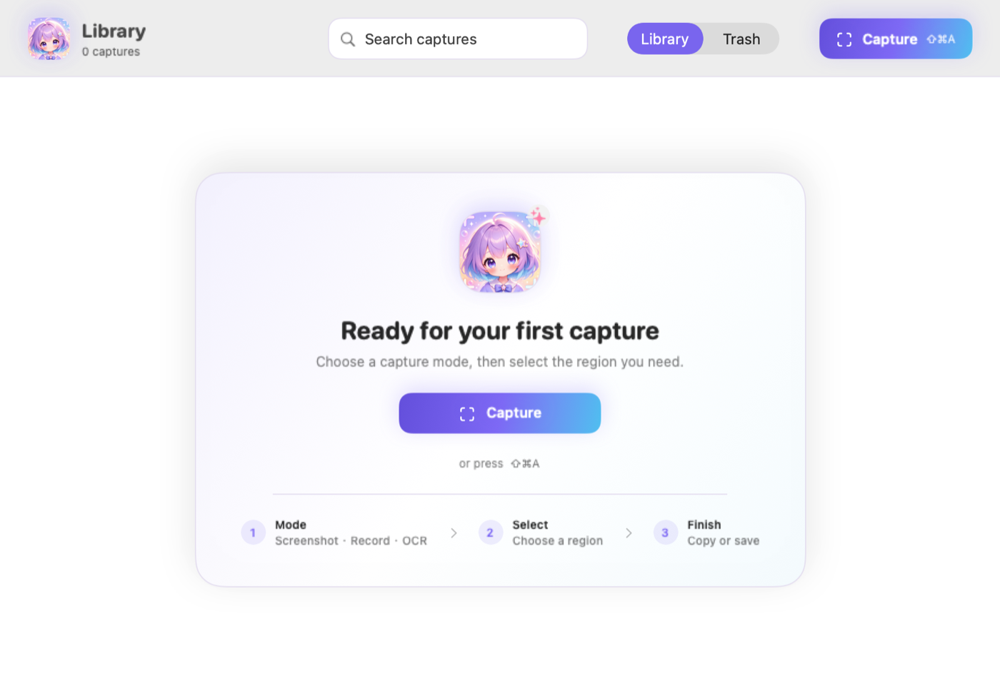

<div align="center">
  
  <h1>kiri</h1>
  <p>A fast, native capture workspace for macOS.</p>
  <p>
    <a href="README_ZH.md">简体中文</a>
    · <a href="README_JA.md">日本語</a>
  </p>
</div>

`kiri` comes from the Japanese word 「切り取り」—to clip or cut out.

Capture screenshots, annotate, recognize text, record regions, and keep everything in a local library. No cloud required.

<p align="center">
  
</p>

## Features

- **Screenshots** — window or region capture with precise selection.
- **Annotations** — pen, shapes, arrows, text, and mosaic with undo/redo.
- **OCR** — local text recognition powered by macOS Vision.
- **Recording** — region recording with optional audio, pointer, and click highlights.
- **GIF** — convert short recordings into looping GIFs.
- **Local library** — search, favorite, copy, reveal, and recover deleted captures.

## Download

Download the latest build from [GitHub Releases](https://github.com/yuxino/kiri/releases/latest), unzip it, and move `Kiri.app` to Applications.

Kiri needs **Input Monitoring** for the global shortcut and **Screen & System Audio Recording** for capture. Everything stays on your Mac unless you export it yourself.

## Build from source

Requires macOS 14+ and Swift 6.

```bash
git clone https://github.com/yuxino/kiri.git
cd kiri
swift run kiri-core-tests
./scripts/install-app.sh
open /Applications/Kiri.app
```

## Shortcuts

- **⇧⌘A** — open Kiri
- **Esc** — cancel capture
- **Return** — copy capture
- **V** — select / move annotations
- **P / R / L / A / T / M** — pen / rectangle / line / arrow / text / mosaic
- **Delete** — delete selected annotation
- **⌘F** — search the library
- **⌘Z / ⇧⌘Z** — undo / redo

See [ROADMAP.md](ROADMAP.md), [CONTRIBUTING.md](CONTRIBUTING.md), and [SECURITY.md](SECURITY.md).

[MIT](LICENSE) © 2026 yuxino
