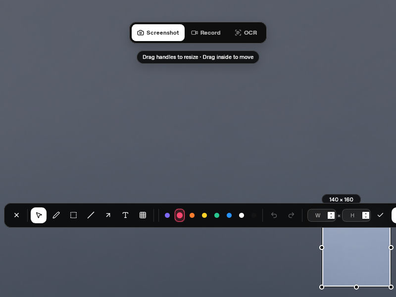
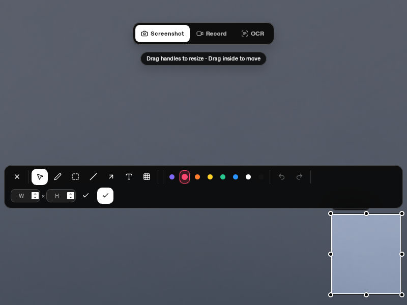

# Capture toolbar viewport regression (#65)

## Actual native before

This unedited 800×600 screenshot was collected from the official v1.6.6 amd64
Debian package on a cloud Debian 13 / Xfce / X11 desktop with an empty QA profile.
The content is a public test background. Debian 13 / Xfce is outside the documented
Ubuntu 24.04 / GNOME support target.

- Primary virtual output: DUMMY0, 1364×1024 at (0, 0).
- Secondary virtual output: DUMMY1, 800×600 at (1364, 0).
- Both outputs use scale 1. This is virtual mixed-resolution evidence, not physical mixed DPI.
- Capture on DUMMY1: local region (650, 420) to (790, 580), 140×160.
- Toolbar's Done button is clipped and the toolbar overlaps the region's top edge.
- Return saves the correct region; mouse Done is the regression under test.
- Release package SHA256: `3de2f5aaabea99233ba06ac5df14ecf255ad82c3c222e052929f2affca9d4895`.
- Linux package source: `78111e9c0ca39bc055f4a164d2ee9f8d3e192f26` (package provenance, not release target).
- Screenshot SHA256: `40c22c1279e26825dc0d33285f30ca6a892fdf7de20a46472a3642b6c82edb4a`.

## Fix and automated checks

The toolbar wraps when its natural width exceeds the overlay's logical width
minus an 8-point margin on each side. ResizeObserver measures its full width and
height; placement chooses below or above the selected region using that measured
height and clamps it inside the viewport. Wide displays retain a single row.

- `scripts/toolbar-layout.test.mjs`: original bottom-right region, wide display,
  all corners at 640×480 / 800×600 / 1512×982, changed heights and nonzero bounds.
- `docs/demos/full-flow/test_toolbar.py`: the actual built frontend with the
  documentation-only IPC boundary. Checks all controls at four corners across
  those three logical sizes, scale 1 / 1.5 / 2 and English / Chinese / Japanese;
  rechecks after Text / Mosaic / Pen / Select transitions and clicks Done.
  This does not test native display selection, physical backing pixels, OCR,
  clipboard ownership or native PNG output. Its screenshot is a **renderer
  fixture**, not the actual native after image.

## Actual native after

Cloud QA replayed the same two outputs, English UI, scale 1 and (650, 420) to
(790, 580) selection. The toolbar wraps to two rows, all controls including Done
are visible, and it sits above the selection. Both screenshots are unedited,
original-size 800×600 images of the same public background. The delivered files
were named `.png` but contain JPEG bytes; repository copies use `.jpg` names
without any change to those bytes. The exported capture below is an actual PNG.

1. Install the exact candidate below in the isolated QA runtime/profile.
2. Move the pointer to DUMMY1 and press Ctrl+Shift+A; choose Screenshot.
3. Drag (650, 420) to (790, 580) in the local 800×600 overlay.
4. Save the unedited overlay image. Click the visible Done button with the mouse;
   do not use Return for this acceptance step.
5. Verify the saved PNG is 140×160. [Actual output](candidate-saved-140x160.png).
6. Restore the original virtual layout. Cloud QA confirmed the desktop root was
   back to 1364×1024 and the extra DUMMY1 output was disabled.

- PR head: `18259a1ad945fa18219a31d4923d03b17b24ca60`.
- Tested CI merge source: `a8bdb4ea423a13416bb1dd8b8c8eeb3ee701b866`, containing
  main `1851f58` and this PR head.
- CI run: [36712386915](https://github.com/yuxino/kiri/actions/runs/36712386915),
  attempt 1; all 10 jobs passed.
- Artifact: `kiri-linux-deb`, ID `11094647135`.
- Candidate package: `kiri_1.6.6_amd64.deb`, SHA256
  `9ca27cdd8a917385b6f73d8e6586a7b699b49b5d4b932c2127832b1a46c745ca`.
- After image SHA256:
  `5d783fd3f3df5ca93d154a9e8cb53195dd3236fd35e9351580fcf3a148533762`.
- [Package provenance](candidate-provenance.json),
  [actual display inventory](candidate-display-inventory.txt), and
  [scoped native acceptance report](native-after-report.json).

These evidence-only files are on `qa/pr66-toolbar-evidence`; the tested product
branch remains at the PR head above. No extra build or native GUI was started on
Mac to publish them.

Physical mixed-DPI, macOS/Windows native toolbar acceptance and supported Ubuntu
native confirmation of this exact dual-output scenario remain separate coverage
limits. Ubuntu X11 CI native checks and four GNOME Wayland scale checks passed,
but are different scenarios. This PR does not change capture coordinates or
supported platforms.
