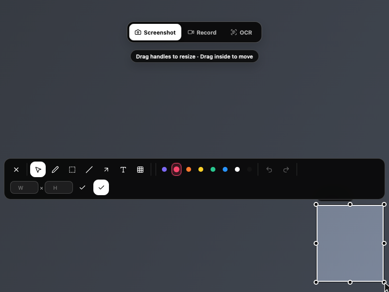
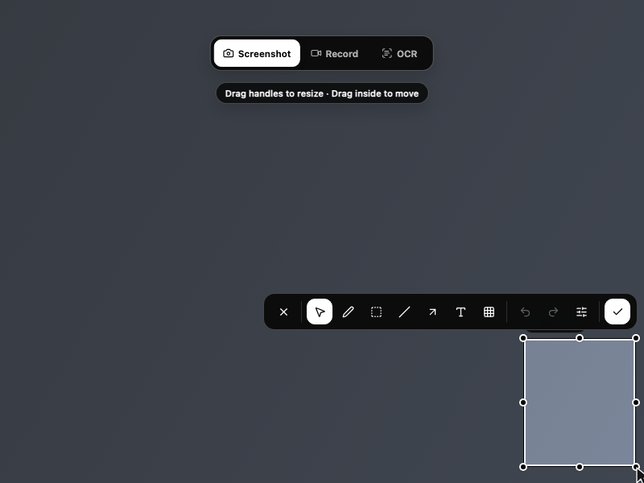
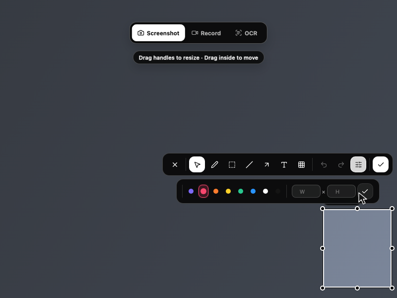

# Approved compact toolbar preview

These are actual built-frontend browser screenshots using the documentation-only
IPC fixture on a public synthetic background, **not native platform capture**.
All three are English, 800×600 logical viewport, scale 1, selection
(650,420) → (790,580). The current baseline is PR head 18259a1; the compact
proposal was previewed in an isolated branch before integration as d6cf7e4.
The proposal screenshots predate the minor orphan-separator cleanup and
keyboard disclosure handling; final native candidate acceptance is separate.

One isolated headless browser checked 48 cases: baseline/proposal × 800×600 or
1512×982 × English/Chinese/Japanese × scale 1/1.25/1.5/2. Every proposal case
checked More open/close, Text/Mosaic/Pen/Select reflow and mouse Done's actual
frontend PNG dimensions. Browser and loopback fixture server exited normally.
There is no physical mixed-DPI, macOS native or Windows native claim here.
