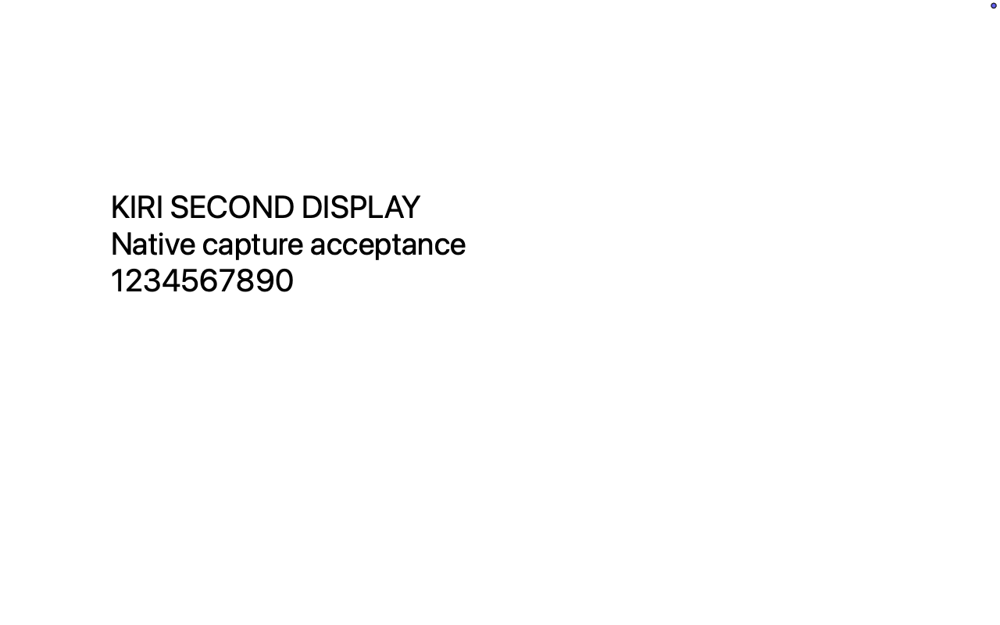
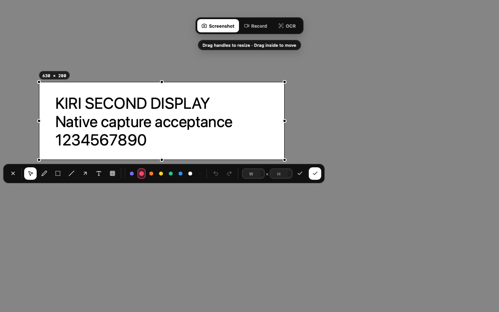
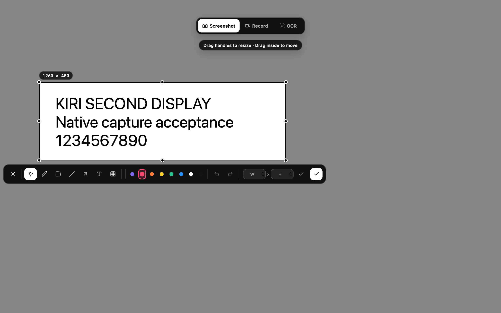
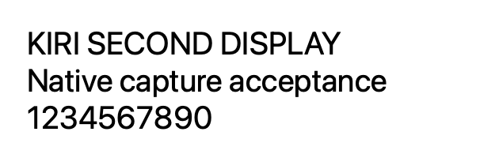

# Issue 21: capture hidden in a secondary full-screen Space

## Reproduction

Baseline: public v1.6.1, main commit `e9e64a3cf12d2a4d9768908aef03aa4b508e1d93`.
Tested on Apple silicon macOS with the signed `/Applications/Kiri.app`, the
native global shortcut, and an OS-level virtual display. Kiri captures the real
desktop; this fixture is a separate native application, not a capture mock.

```sh
clang -fobjc-arc -framework Cocoa -framework CoreGraphics \
  scripts/qa/macos-virtual-display.m -o /tmp/kiri-display-qa
/tmp/kiri-display-qa 1512 0 1 fullscreen
```

After the fixture enters native full screen, move the pointer to it and press
Shift+Command+A. v1.6.1 freezes its pixels and creates the WebView, but the
overlay is absent from the actual display. A screenshot of the Kiri window
alone can show a perfectly rendered overlay even while it is off the active
Space. Check the display itself (`screencapture -x -D 2 ...` on this two-display
setup) and on-screen `CGWindowListCopyWindowInfo` entries instead.



## Candidate acceptance

- Right-side 1× native full-screen display: overlay visible, native region drag,
  Return confirmation, correct 630×200 clipboard pixels, original application
  focused afterward. The test screenshot was moved to recoverable Trash.
- Left-side 2× native full-screen display: correct 1260×400 selection, text
  editing, recording countdown, pause and stop. A 24.76-second 1260×400 MP4 was
  inspected at 0.1, 2.0 and 12.0 seconds: readable fixture content, no Kiri
  controls. The recording was moved to recoverable Trash. The recording panel
  retained the user's existing saved position on the primary display.
- Above-primary 1× native full-screen display: correct negative-origin overlay,
  native Escape before clicking, selection, local OCR of all three fixture
  lines, copying and return. The OCR record was moved to recoverable Trash.
- Three more native shortcut/Escape cycles: the full-display overlay and its
  native parent disappeared after every cancel; the resident feedback parent
  was reused. Ordinary-desktop capture also remained visible and cancellable.
- Language restored to Simplified Chinese, default shortcut unchanged, all
  temporary displays removed, and original 74 capture-grid items preserved.







The before image uses a right-side 1× display; the English after image uses an
above-primary 1× display. Both are unmodified system screenshots of the same
native full-screen fixture. The Retina image is a separate left-side 2× check.

## Limits

The reporter did not specify an operating system. This is a verified macOS
failure consistent with the reported symptom, not confirmation of their exact
setup. Physical external displays, Windows mixed-DPI/multi-GPU desktops, and
Intel Mac native acceptance remain unverified. The isolated virtual display
cannot substitute for those hardware configurations.
