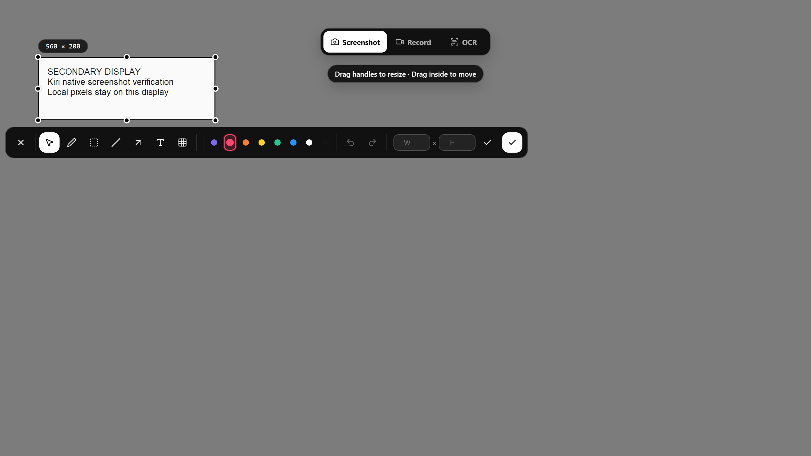
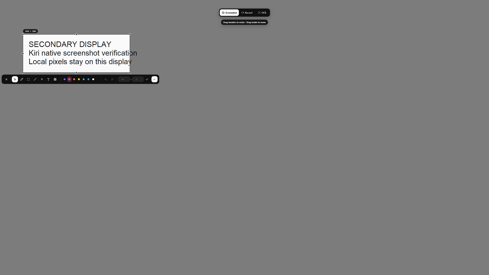
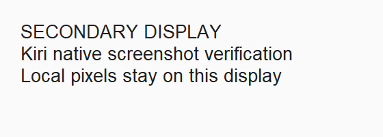

# Issue 21: Windows secondary-display acceptance

## English

The published **v1.6.2** Windows installer completed all 15 native screenshot
cases below. This environment did **not** reproduce the reported failure;
no Windows application code was changed and issue #21 remains open.

[Native CI run](https://github.com/yuxino/kiri/actions/runs/35692812700)
· [Machine-readable results](report.json)

The runner is Windows Server 2025 x64. Two OS-level virtual displays run at
2560×1440; the runner's original 1024×768 display remains connected below the
test primary. Windows, Kiri and GDI all enumerate and use these displays. A
separate native Tk window supplies visible fixture text; Kiri captures the
actual desktop with its unchanged production capture path. No runtime mock or
synthetic capture source is added to Kiri.

| Actual primary scale | Selected display scale | Selected display layouts | Result |
| --- | --- | --- | --- |
| 100% | 100% | Right, left, above | All 3 pass |
| 100% | 125% | Right, left, above | All 3 pass |
| 100% | 150% | Right, left, above | All 3 pass |
| 100% | 200% | Right, left, above | All 3 pass |
| 150% | 100% | Right, left, above | All 3 pass |

Each case verifies the actual DPI, triggers Shift+Ctrl+A on the selected
screen, checks the native overlay's physical bounds, drags a 560×200-pixel
region, confirms with Return, and reads the image from the system clipboard.
All 15 copied images have the expected dimensions and **zero mean pixel
error** against the corresponding real-desktop region captured before Kiri
opened. The primary flag and every monitor's coordinates/DPI are recorded in
`report.json`.

These are unmodified native desktop screenshots, not a browser recreation.

### Repeat

Run **Windows multi-display acceptance** manually in GitHub Actions. Choose a
published release tag and its reviewed x64 installer SHA-256. It installs the
pinned, checksum-verified [Virtual Display Driver](https://github.com/VirtualDrivers/Virtual-Display-Driver/releases/tag/25.7.23)
only on a disposable GitHub-hosted runner. The driver catalog must pass
Authenticode validation; only its verified leaf publisher is added to the
runner's TrustedPublisher store. No root trust or signature-enforcement policy
is changed. The QA-only DPI adjustment uses undocumented Windows request
packets and verifies the resulting DPI through the native monitor API.

The `windows-display-review` artifact contains native source/overlay/selection/
clipboard PNGs, actual display metadata, driver installation diagnostics and
Kiri's application log. It expires after five days; this directory retains the
representative screenshots and complete result matrix.

Verified installer `kiri_1.6.2_x64-setup.exe` SHA-256:
`b8924fccd3f0524cd24e79ecc74a83fe55a526620fe7a5a536a54d1de3bc5c56`.
Installed `kiri.exe` SHA-256:
`f592ec46816420c0bf024df398691ed7f7c3447877d933e6086861dd08752262`.

### Limits

This proves screenshot behavior on a Windows Server virtual-display desktop.
It does not establish physical Windows 11, mixed-GPU/dock, HDR, protected or
exclusive-fullscreen game capture, monitor hot-unplug, secondary-display OCR
or recording acceptance. The original issue provides no Windows version,
display layout, app version, failure screenshot or log. A matching hardware
reproduction is still needed before declaring that report resolved.

## 中文

使用已发布的 **v1.6.2 Windows 安装包**完成了上表全部 15 组原生截图验收。
当前环境**未复现**原报告的故障，因此没有修改 Windows 应用代码，#21 继续保留。

环境为 Windows Server 2025 x64：两个系统级 2560×1440 虚拟屏，原有
1024×768 屏保留在测试主屏下方。测试覆盖右侧、左侧和上方布局，副屏
100%/125%/150%/200% 缩放，以及主屏 150% 配副屏 100%。系统实际的主屏
标记、每屏坐标和 DPI 均记录在 `report.json` 中。

每组通过原生 Shift+Ctrl+A 打开截图，检查截图层的真实物理边界，拖动框选
560×200 像素区域，按 Return 完成，再读取系统剪贴板。15 张图片尺寸均正确，
与截图前实际屏幕对应区域的平均像素差全部为零。上面的图片是原始桌面截图；
独立的原生 Tk 窗口只提供可见的测试文字，Kiri 仍使用正式版真实桌面捕获路径。

可在 GitHub Actions 手动运行 **Windows multi-display acceptance**，指定
已发布版本及审核过的 x64 安装包 SHA-256。仅在一次性的 GitHub 托管机器上
安装固定版本、校验摘要的虚拟显示驱动，并验证驱动目录签名，只信任已验证的
发布者叶证书，不修改根证书信任或关闭签名检查。缩放调整使用仅限验收脚本的
Windows 非公开请求格式，并用系统显示器 API 核实实际 DPI。

`windows-display-review` 构建产物保留完整图片、显示器信息、驱动诊断和
Kiri 日志五天；本目录长期保留代表性图片和完整结果。版本、文件名和摘要见
上方英文部分。

这些结果不能代替实体 Windows 11、混合显卡/扩展坞、HDR、受保护内容或独占
全屏游戏、显示器热拔插、副屏 OCR 或录屏验收。原 issue 未提供 Windows
版本、屏幕布局、Kiri 版本、故障截图或日志，仍需要匹配实际硬件环境的复现。
