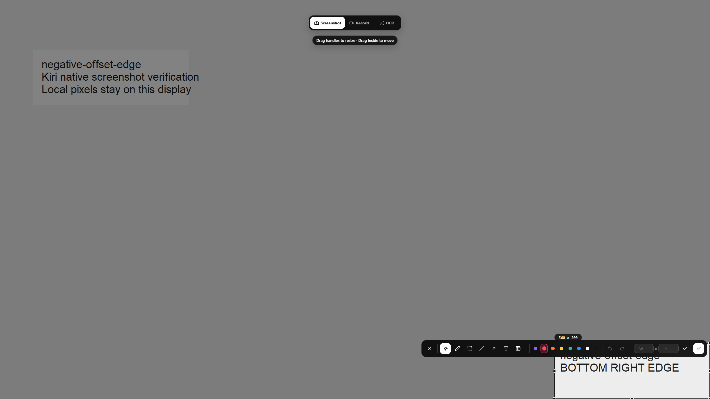

# Issue 21: additional Windows capture scenarios

## English

On 2026-09-23, the unchanged published **v1.6.2** installer passed nine
additional native screenshot scenarios on the isolated Windows Server 2025
virtual-display desktop. The original failure was not reproduced. This is
acceptance evidence, not a Windows application fix.

[Extended run](https://github.com/yuxino/kiri/actions/runs/35819247022)
· [15-case baseline with fresh clipboard checks](https://github.com/yuxino/kiri/actions/runs/35818954620)

| Scenario | Primary / secondary scale | Result |
| --- | --- | --- |
| Right secondary, both screens at fractional scales | 125% / 150% | Pass |
| Left secondary, higher-scale primary | 200% / 125% | Pass |
| Above secondary, Escape followed by immediate retry | 150% / 175% | Pass |
| Click a complete native window on the left secondary | 125% / 150% | Pass |
| Portrait secondary, 1440×2560 | 100% / 150% | Pass |
| Disconnect from desktop, restore extended desktop, capture on left | 100% / 150% | Pass |
| Select near bottom-right edge at negative X and Y | 150% / 125% | Pass |
| Capture on primary after secondary | 150% / 125% | Pass |
| Return to secondary after primary | 150% / 125% | Pass |

Each capture starts with an empty system clipboard, waits for a new image and
for the native overlay to close, then checks image dimensions and pixels
against the actual desktop region. All 24 cases (15 baseline plus nine
additional) had zero mean pixel error. Each ordinary region contains its case
name so an earlier capture cannot silently satisfy a later case.

The reconnect scenario disables the secondary Windows desktop output, verifies
that it disappears from monitor enumeration, restores extended desktop with
Windows DisplaySwitch, and captures again without restarting Kiri. It does not
simulate a physical cable, dock or GPU-driver removal. Two initial harness runs
failed while attempting to re-enable the output with ChangeDisplaySettingsEx;
those failures occurred before asking Kiri to capture and are not product bugs.

Use the existing workflow's `suite` input: `baseline` for the 15 layouts or
`extended` for these nine scenarios. Installer identity and the physical-device
limits in [the original report](README.md) still apply. No production code,
version or release asset changed in this follow-up. Issue #21 remains open.

[Machine-readable results](extended-report.json)

## 中文

2026-09-23 使用未改动的正式 **v1.6.2** Windows 安装包，在隔离的 Windows
Server 2025 系统级虚拟多屏桌面补测了上表九种场景，全部通过。仍未复现原报告
的故障；这份记录是验收证据，不是 Windows 应用修复。

新增覆盖双屏同时使用不同缩放、175% 副屏取消后立即重试、点击完整窗口、竖屏、
断开并恢复扩展桌面、负坐标边缘，以及主副屏连续切换。每次先清空系统剪贴板，
等待新图片和真实截图窗口关闭，再比对尺寸和实际桌面像素。原有 15 组和新增
九组，共 24 组的平均像素差均为零；普通选区包含各自场景名以排除旧图误判。

重连场景只停用 Windows 桌面的副屏输出，验证系统不再枚举它，再使用系统自带
DisplaySwitch 恢复扩展桌面，保持 Kiri 进程不重启。它不能代替拔插实体线缆、
扩展坞或显卡驱动移除。前两次脚本在使用 ChangeDisplaySettingsEx 恢复输出时
失败，当时尚未要求 Kiri 截图，因此不算产品故障。

工作流的 `suite` 输入可选原有 15 组 `baseline` 或新增九组 `extended`。
安装包身份和[原报告](README.md)中的实体设备限制不变。本次未改生产代码、
版本或发布资源，#21 继续保留开放。
